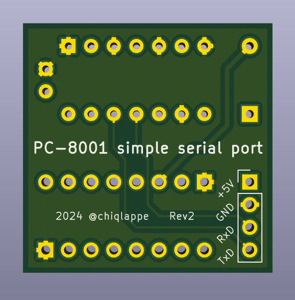
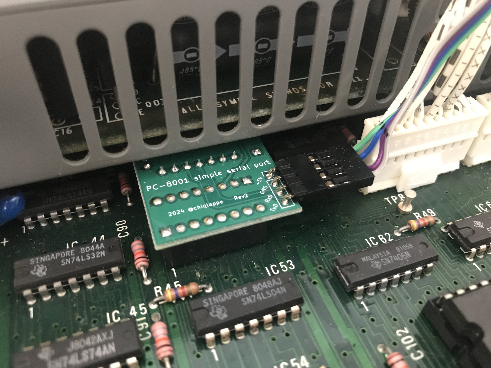

# PC-8001用 シンプルシリアルポート

## 概要
- PC-8001のSIOソケットをTTLレベルのシリアルポートに変換します

## 仕様
|項目|仕様|
|:-|:-|
|信号|RxD,TxD ([FT234X](https://akizukidenshi.com/catalog/g/g108461/)とピン互換)|
|信号レベル|TTL|

## 部品表
|名称|値|数量|設置面|メモ|
|:-|:-|:-:|:-|:-|
|ロジックIC|74LS04|1|うら||
|セラミックコンデンサ|0.01u|1|うら||
|整流ダイオード|1N4007|1|うら|[秋月電子](https://akizukidenshi.com/catalog/g/g100934/)|
|ピンヘッダ|オスL型 1x4(4p)|1|おもて| |
|細ピンヘッダ|1x8(8p)|2|うら|[秋月電子](https://akizukidenshi.com/catalog/g/g106631/)|

- 細ピンヘッダはブレッドボードに差し込んだ状態でハンダ付けすると歪みにくくなります

## 接続ケーブルの製作
|名称|値|数量|メモ|
|:-|:-|:-:|:-|
|フラットケーブル|4芯40cm|1|[マルツ](https://www.marutsu.co.jp/pc/i/2177031/)|
|QIコネクタ|1x4(4p)|2|[秋月電子](https://akizukidenshi.com/catalog/g/g112153/)|

- QIコネクタの三角の目印が同じ色になるように配線して下さい

## 設置方法
- 本体の電源を切ります
- キーボードコネクタ左側のSIOソケットに挿入します
- 上部の金属部分にハンダ面が接触しないように注意して下さい

- 接続ケーブルをピンヘッダに挿入します
- 反対のコネクタを接続する際は必ず信号の並びを確認して下さい。故障の原因になります
